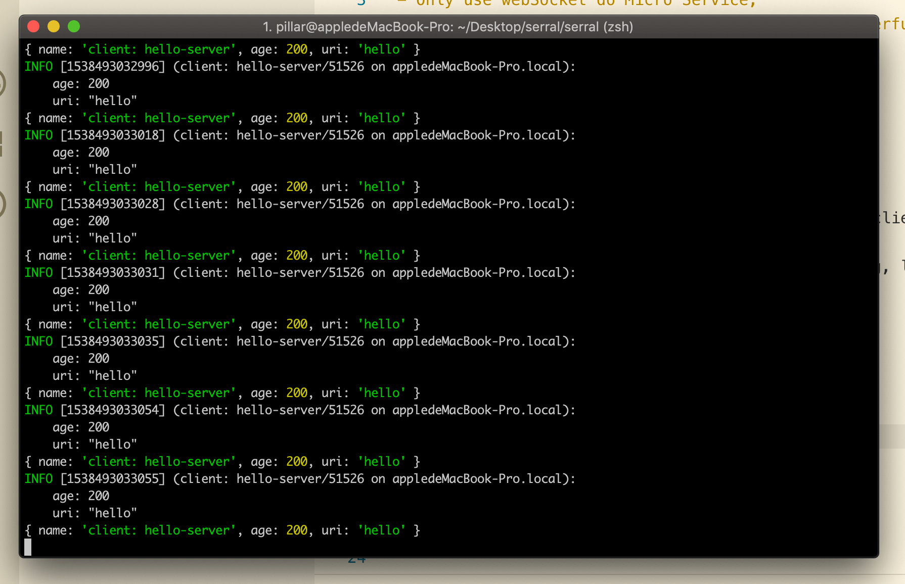
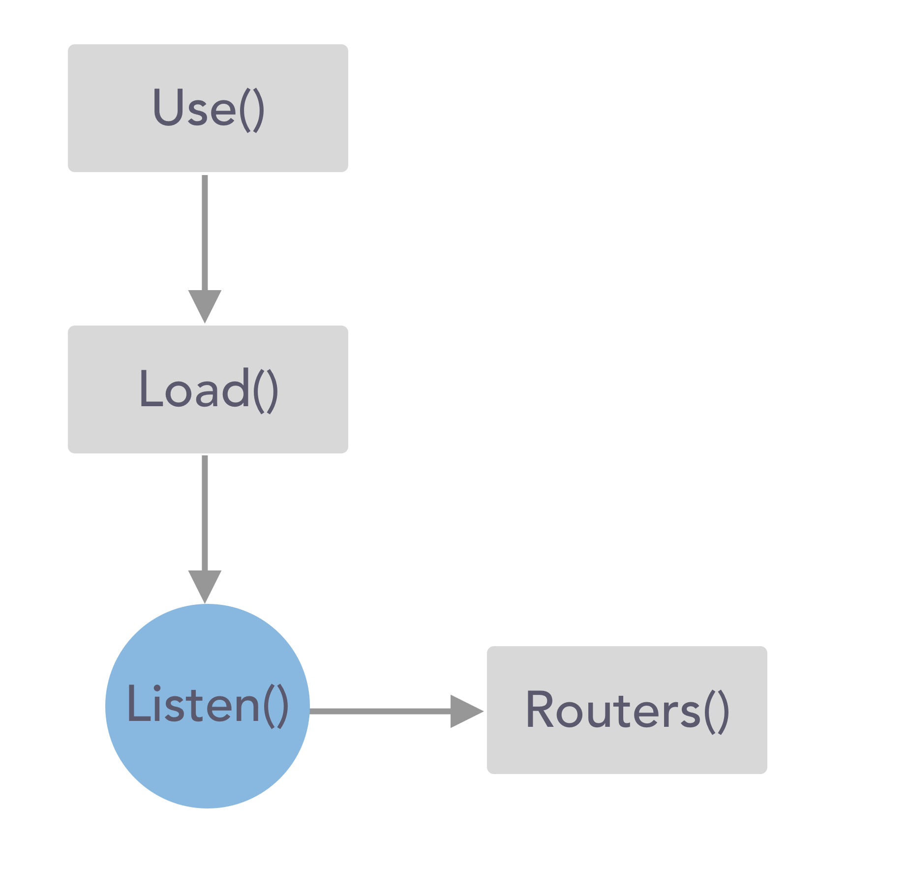

# Use uWebSockets like http

- Only use webSocket do Micro Service;
- Like Serral in StarCraft2, Simple and direct powerful.

## Look Demo

Copy this code in your Terminal:

```
git clone -b master --single-branch https://github.com/ymzuiku/serral
cd serral
yarn install && clear
node example/serve.js & sleep 0.5 && open example/client.html
```
Waiting git clone and npm install, if server runing, look Terminal and Browser.



The Web is at 30ms emit socket server;

## Install

```
$ npm i --save serral
# or
$ yarn add -D serral
```

## Get Started

your can look example/serve.js and example/client.html

### Client:

If your use React or Vue, add code in `src/index.js`

```js
import serralClient from 'serral/client';
const ws = serralClient('ws://127.0.0.1:4000');
ws.onopen = function() {
  ws.dispatch(
    'hello',
    {
      name: 'client: hello-server',
      age: 200,
    },
    res => {
      console.log('catch-server-message:', res);
    },
  );
};
```

### Server:

server/index.js

```js
const serral = require('serral');
const path = require('path');

// auto load routers/xxx.js and router/xxx/index.js;
// ignore underline begins files, like: _xxx.js
serral.load(path.resolve(__dirname, 'routers'));
serral.listen(4000);
```

server/routers/hello.js

```js
module.exports = function(data, ws) {
  console.log(data);
  ws.dispatch({ name: 'server:hello-client', age: 100 });
};
```

Run serve:

```sh
node server/index.js
```

## Load routers  rule:

Use `serral.load('dir-path')`, serral can audo load files:
- If file return a `function`, serral use the file name like router path.
- If file return a `{ obj }`, serral use file.objName.objName... until obj is function
- If the 'file' is Directory, serral use require(file/index.js)
- Ignore underline begins files, like: _xxx.js

This's example:

Server

server/index.js

```js
const serral = require('serral');
const path = require('path');
serral.load(path.resolve(__dirname, 'routers'));
serral.listen(4000);
```
server/routers/login.js

```js
module.exports = {
  // In client: ws.dispatch('login.useEmail');
  useEmail: function(data, ws, opts) {
    // ..
  },
  sendEmail: {
    // In client: ws.dispatch('login.sendEmail.changePassword');
    changePassword: function(data, ws, opts) {
      // ..
    },
    bindEmail: {
      // In client: ws.dispatch('login.sendEmail.bindEmail.bindNow');
      bindNow: function(data, ws, opts) {
        // ..
      },
    },
  },
};
```

Client

```js
import serralClient from 'serral/client';
const ws = serralClient('ws://127.0.0.1:4000');
ws.onopen = function() {
  // load server routers/login.js function
  ws.dispatch('login.useEmail');
  ws.dispatch('login.sendEmail.changePassword');
  ws.dispatch('login.sendEmail.bindEmail.bindNow');
};
```

## If use mysql or other database

Server:

server/index.js

```js
const serral = require('../serve');
const Sequelize = require('sequelize');
const { resolve } = require('path');

const sequelize = new Sequelize('test', 'root', '111Asd', { dialect: 'mysql' });
sequelize.authenticate();

// send { db: sequelize } to opts; and serral.use() need before serral.load()
serral.use({ db: sequelize });
serral.load(resolve(__dirname, 'routers'));
serral.listen(4000);
```

server/routers/hello.js

```js
module.exports = function(data, ws, opts) {
  console.log(opts); // { db: sequelize }
  // use opts.db do someting
};
```

## Use local log files

Set `logPath`, log save in local file, use [pino](https://github.com/pinojs/pino)

```js
const serral = require('../serve');
const path = require('path');

// serral.use() need before serral.load()
serral.use({ logPath: path.resolve(__dirname, 'logs') });
serral.load(path.resolve(__dirname, 'routers'));
serral.listen(4000);
```

## Use WebSocket change to uWebSockets

serral default use uWebSockets, but it's remove in npm.org. if you need use WebSocket, you can use `lib: 'ws'`:

```js
const serral = require('../serve');
const path = require('path');
serral.use({ lib: 'ws');
serral.load(path.resolve(__dirname, 'routers'));
serral.listen(4000);
```

## API setting live




## Licenes

```
MIT License

Copyright (c) 2013-present, Facebook, Inc.

Permission is hereby granted, free of charge, to any person obtaining a copy
of this software and associated documentation files (the "Software"), to deal
in the Software without restriction, including without limitation the rights
to use, copy, modify, merge, publish, distribute, sublicense, and/or sell
copies of the Software, and to permit persons to whom the Software is
furnished to do so, subject to the following conditions:

The above copyright notice and this permission notice shall be included in all
copies or substantial portions of the Software.

THE SOFTWARE IS PROVIDED "AS IS", WITHOUT WARRANTY OF ANY KIND, EXPRESS OR
IMPLIED, INCLUDING BUT NOT LIMITED TO THE WARRANTIES OF MERCHANTABILITY,
FITNESS FOR A PARTICULAR PURPOSE AND NONINFRINGEMENT. IN NO EVENT SHALL THE
AUTHORS OR COPYRIGHT HOLDERS BE LIABLE FOR ANY CLAIM, DAMAGES OR OTHER
LIABILITY, WHETHER IN AN ACTION OF CONTRACT, TORT OR OTHERWISE, ARISING FROM,
OUT OF OR IN CONNECTION WITH THE SOFTWARE OR THE USE OR OTHER DEALINGS IN THE
SOFTWARE.
```
